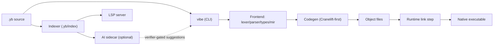

# VibeLang

VibeLang is a systems-oriented programming language and toolchain aiming for native
performance with a developer experience that stays simple and practical.

The project combines:

- A deterministic native compiler pipeline (no AI in compile path)
- Built-in intent/contracts (`@intent`, `@examples`, `@require`, `@ensure`,
  `@effect`)
- Structured concurrency primitives (`go`, `chan`, `select`, `after`)
- AI-assisted linting as an optional sidecar, verifier-gated and non-blocking

## Table of Contents

- [Project Pitch](#project-pitch)
- [What VibeLang Solves Today](#what-vibelang-solves-today)
- [What Is Experimental / In Progress](#what-is-experimental--in-progress)
- [Use Cases](#use-cases)
- [Architecture](#architecture)
- [Installation](#installation)
- [60-Second Quickstart](#60-second-quickstart)
- [Code Samples](#code-samples)
- [Troubleshooting](#troubleshooting)
- [Roadmap Snapshot](#roadmap-snapshot)
- [Contributing: Start Here](#contributing-start-here)

## Project Pitch

VibeLang is built for teams who want to ship low-latency native programs without
fighting the language every day. The design goal is a high-signal language surface:
small syntax, explicit effects, deterministic build outputs, and first-class intent
metadata that tooling can understand.

## What VibeLang Solves Today

Current, implemented capabilities:

- Native AOT compile pipeline with deterministic diagnostics and artifacts
- Core CLI flow: `vibe check`, `build`, `run`, `test`, `fmt`, `doc`, `new`, `pkg`,
  `index`, `lsp`, `lint --intent`
- Canonical `.yb` source extension with legacy `.vibe` support during migration
- Contract and intent annotations with executable examples
- Concurrency fixtures and negative diagnostics for misuse patterns
- Incremental semantic indexing and LSP line-stdio support

## What Is Experimental / In Progress

These areas are intentionally marked as not-final:

- AI sidecar quality and suggestion depth are evolving; compile correctness does not
  depend on AI
- Self-hosting path is seeded and tracked, not yet full toolchain self-hosted
- Packaging and release distribution are still source-first for v1 preparation
- Phase 7.3 and 7.4 hardening (release gates + book-grade docs) are in progress

## Use Cases

- **Systems tooling**: CLI tools, compilers, build utilities that need fast startup
  and deterministic behavior
- **Concurrent services**: workloads that benefit from typed channels and structured
  task orchestration
- **Deterministic pipelines**: CI/build paths where stable outputs and clear failure
  modes matter
- **Intent-aware development**: teams that want contracts/examples near code and
  optional AI linting for intent drift

## Architecture



Boundary rule: the AI sidecar is optional and outside the deterministic native compile
path.

## Installation

### 1) Build from source (recommended today)

```bash
git clone <your-fork-or-repo-url>
cd vibelang
cargo build --release -p vibe_cli
./target/release/vibe --help
```

### 2) Local binary usage without global install

```bash
export PATH="$PWD/target/release:$PATH"
vibe --help
```

You can also call the binary directly:

```bash
./target/release/vibe run path/to/program.yb
```

### 3) Packaged release (planned)

Prebuilt artifacts and package-manager distribution are planned for v1 release tracks.
Until then, use source builds and pin toolchain versions in CI.

## 60-Second Quickstart

```bash
# one-time setup
cargo build --release -p vibe_cli
export PATH="$PWD/target/release:$PATH"

# create, run, test, format, and document a new app
vibe new hello
cd hello
vibe run main.yb
vibe test main.yb
vibe fmt . --check
vibe doc . --out docs/api.md
```

Expected `vibe run` output:

```txt
hello from vibelang
```

## Code Samples

### Hello World

```txt
pub main() -> Int {
  @effect io
  println("hello from vibelang")
  0
}
```

### Intent + Contract Sample

```txt
pub clamp_percent(done: Int, total: Int) -> Int {
  @intent "return completion percent clamped to [0, 100]"
  @examples {
    clamp_percent(0, 10) => 0
    clamp_percent(5, 10) => 50
    clamp_percent(10, 10) => 100
  }
  @require total > 0
  @ensure . >= 0
  @ensure . <= 100
  @effect alloc

  raw := (done * 100) / total
  if raw < 0 {
    0
  } else if raw > 100 {
    100
  } else {
    raw
  }
}
```

You can lint intent conformance on demand:

```bash
vibe lint . --intent --changed
```

## Troubleshooting

- **`cargo` or `rustc` missing**: install Rust toolchain from `rustup` and confirm
  with `cargo --version`
- **Linker/build errors on Linux**: ensure a C toolchain is installed
  (`build-essential`/`clang`, depending on distro)
- **Unsupported target triple**: use one of the currently supported targets and verify
  with project docs under `docs/targets/`
- **Mixed-extension same-stem conflict**: avoid having both `foo.yb` and `foo.vibe`
  in the same directory during migration

## Roadmap Snapshot

- Primary execution plan: [`docs/development_checklist.md`](docs/development_checklist.md)
- Phase 7.1 validation matrix:
  [`reports/phase7/language_validation_matrix.md`](reports/phase7/language_validation_matrix.md)
- Phase 7.1 sample catalog:
  [`reports/phase7/sample_programs_catalog.md`](reports/phase7/sample_programs_catalog.md)
- Source extension migration policy:
  [`docs/policy/source_extension_policy_v1x.md`](docs/policy/source_extension_policy_v1x.md)

## Contributing: Start Here

Local quality bar before opening a PR:

```bash
cargo fmt --all
cargo clippy --workspace --all-targets -- -D warnings
cargo test -p vibe_cli
```

Additional expectations:

- Keep behavior deterministic and reproducible
- Add/update fixtures and evidence reports for user-visible changes
- Treat AI outputs as suggestions; verifier-gate and re-check in compiler path
