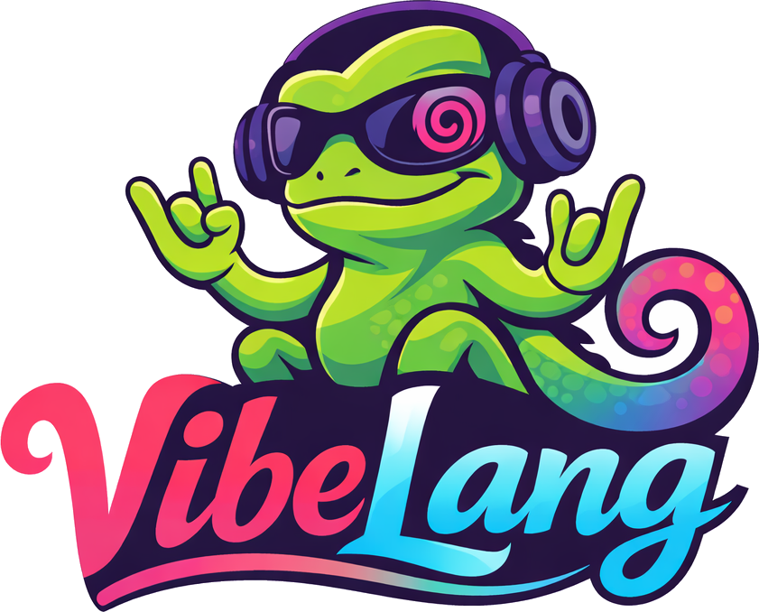
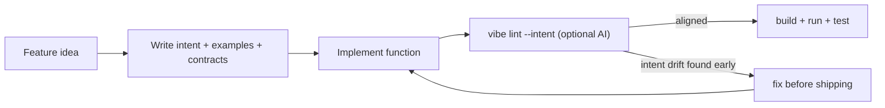
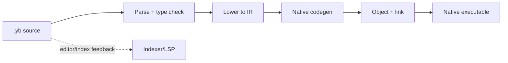
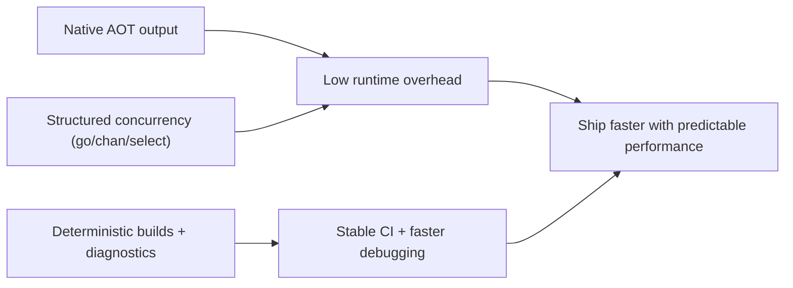

# VibeLang

> Fast like systems languages. Smooth like scripting languages.  
> Built for the AI era with **Intent Driven Development**.

<!-- markdownlint-disable MD033 -->
<p align="center">
  
</p>

<table width="100%">
  <tr>
    <td align="center" width="25%">
      <a href="#roadmap-snapshot"></a>
    </td>
    <td align="center" width="25%">
      <a href="#what-vibelang-is"></a>
    </td>
    <td align="center" width="25%">
      <a href="#why-i-built-this"></a>
    </td>
    <td align="center" width="25%">
      
    </td>
  </tr>
</table>

<table width="100%">
  <tr>
    <td align="center" width="25%"><a href="#60-second-quickstart"><strong>Quickstart</strong></a></td>
    <td align="center" width="25%"><a href="#why-i-built-this"><strong>Why I Built This</strong></a></td>
    <td align="center" width="25%"><a href="#what-vibelang-solves-today"><strong>What VibeLang Solves Today</strong></a></td>
    <td align="center" width="25%"><a href="#roadmap-snapshot"><strong>Roadmap</strong></a></td>
  </tr>
</table>
<!-- markdownlint-enable MD033 -->

## Table of Contents

- [Project Pitch](#project-pitch)
- [At a Glance](#at-a-glance)
- [Why I Built This](#why-i-built-this)
- [What VibeLang Is](#what-vibelang-is)
- [What VibeLang Solves Today](#what-vibelang-solves-today)
- [What Is Experimental / In Progress](#what-is-experimental--in-progress)
- [Use Cases](#use-cases)
- [Installation](#installation)
- [60-Second Quickstart](#60-second-quickstart)
- [Code Samples](#code-samples)
- [Architecture](#architecture)
- [Roadmap Snapshot](#roadmap-snapshot)
- [Troubleshooting](#troubleshooting)
- [Contributing: Start Here](#contributing-start-here)

## Project Pitch

VibeLang is a native-first language for builders who want low-level performance
without low-level pain.

## At a Glance

| Area | Current V1 posture |
| --- | --- |
| Build model | Deterministic native AOT compile path with reproducibility gates |
| Developer loop | `check`, `build`, `run`, `test`, `fmt`, `doc`, `lint --intent` |
| Correctness features | Contracts, executable examples, effect annotations |
| Concurrency | `go`, `chan`, `select`, cancellation, bounded stress coverage |
| Distribution track | Packaged release workflow with checksum/signature/provenance/SBOM wiring |

## Why I Built This

I wanted a language that feels simple to write, but still compiles to serious native
performance.

The core idea is what I call **Intent Driven Development**:

- You write code *and* intent together
- The language gives you guardrails (`@intent`, `@examples`, `@require`, `@ensure`, `@effect`)
- The AI linter can catch intent drift and logic mismatch early
- Final compile path stays deterministic and native (AI is optional, not required)

The goal is straightforward: build the **right thing** faster, without giving up
performance, safety, or clarity.

## What VibeLang Is

VibeLang is a native-first language + toolchain with:

- deterministic AOT compilation
- low-noise syntax
- first-class contracts and intent annotations
- structured concurrency (`go`, `chan`, `select`, `after`)
- optional AI sidecar for intent linting and guidance

## What VibeLang Solves Today

- **AI-era intent drift:** LLM-generated code can look correct but violate product intent.  
  VibeLang keeps intent in code (`@intent`, `@examples`) and checks drift early with `vibe lint --intent`.
- **Correctness gaps that appear too late:** Contracts (`@require`, `@ensure`) and examples make behavior executable, not just documented.
- **Concurrency bugs in high-throughput services:** Native `go`/`chan`/`select` plus safety diagnostics catch risky shared-mutation and capture patterns earlier.
- **Non-reproducible native build behavior:** Deterministic diagnostics and repeatability checks reduce CI surprises and "works on my machine" failures.
- **Performance vs developer velocity tradeoff:** You get native compilation and systems-level control with a simpler, lower-noise language surface.

## Use Cases

- **LLM-generated production codebases** where teams need generated code to stay
  correct, auditable, and deterministic
- **Agentic systems and autonomous workflows** where multiple agents generate,
  refactor, and verify code continuously
- **Modern backend and platform services** that need concurrency, performance, and
  clear correctness guardrails
- **General application development** for teams that want a simpler developer
  experience without giving up native performance
- **High-signal AI-assisted teams** that want intent-aware linting to catch
  requirement drift before it reaches prod

## What Is Experimental / In Progress

- deeper AI suggestions/autocomplete quality
- full self-hosting path
- broader target expansion beyond current tier-1 packaged matrix

## Installation

### Option A: Packaged install (recommended, no Cargo required)

Use the platform guides and follow the verify + PATH steps:

- Linux: `docs/install/linux.md`
- macOS: `docs/install/macos.md`
- Windows: `docs/install/windows.md`

After install, validate the CLI:

```bash
vibe --version
vibe --help
```

Run your first program:

```bash
cat > hello.yb <<'EOF'
pub main() -> Int {
  @effect io
  println("hello from vibelang")
  0
}
EOF

vibe run hello.yb
```

Expected output:

```txt
hello from vibelang
```

### Option B: Build from source (contributor/developer path)

```bash
git clone https://github.com/skhan75/VibeLang.git
cd VibeLang
cargo build --release -p vibe_cli
export PATH="$PWD/target/release:$PATH"
vibe --version
vibe --help
vibe run compiler/tests/fixtures/build/hello_world.vibe
```

### Packaged releases

Packaged binaries are produced by workflow `.github/workflows/v1-packaged-release.yml`
with checksums, signatures, provenance statements, and SBOM artifacts.

## 60-Second Quickstart

### Quickstart (from source)

```bash
git clone https://github.com/skhan75/VibeLang.git
cd VibeLang
cargo build --release -p vibe_cli
export PATH="$PWD/target/release:$PATH"

vibe new hello
cd hello
vibe run main.yb
vibe test main.yb
vibe fmt . --check
vibe doc . --out docs/api.md
```

Expected output:

```txt
hello from vibelang
```

For no-Cargo quickstart, use `Installation -> Option A` above.

## Code Samples

### Hello

```txt
pub main() -> Int {
  @effect io
  println("hello from vibelang")
  0
}
```

### Intent Driven Development example

```txt
pub clamp_percent(done: Int, total: Int) -> Int {
  @intent "return completion percentage clamped to [0, 100]"
  @examples {
    clamp_percent(0, 10) => 0
    clamp_percent(5, 10) => 50
    clamp_percent(10, 10) => 100
  }
  @require total > 0
  @ensure . >= 0
  @ensure . <= 100
  @effect alloc

  raw := (done * 100) / total
  if raw < 0 {
    0
  } else if raw > 100 {
    100
  } else {
    raw
  }
}
```

Run intent lint:

```bash
vibe lint . --intent --changed
```

## Architecture

### 1) Intent-first development loop



### 2) Fast compile path to native



### 3) Why it stays efficient



Rule of thumb: AI can assist writing and linting, but compile correctness stays in the
deterministic compiler path.

## Roadmap Snapshot

- Main tracker: [`docs/development_checklist.md`](docs/development_checklist.md)
- [Language validation matrix](docs/language_validation_matrix.md)
- [Sample programs catalog](docs/sample_programs_catalog.md)

## Troubleshooting

- Missing Rust tools: install `rustup`, then verify with `cargo --version`
- Linux linker issues: install a C toolchain (`build-essential` or `clang`)
- Mixed extensions: avoid `foo.yb` and `foo.vibe` in the same folder

## Contributing: Start Here

```bash
cargo fmt --all
cargo clippy --workspace --all-targets -- -D warnings
cargo test -p vibe_cli
```

PRs are welcome. Keep it deterministic, keep it tested, keep it readable.
