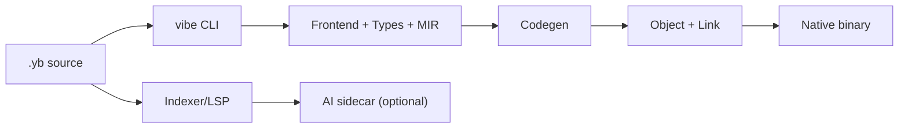

# VibeLang

> Fast like systems languages. Smooth like scripting languages.  
> Built for the AI era with **Intent Driven Development**.

## Branding Placeholders

<!-- Replace these when brand assets are ready -->
- Mascot logo placeholder: `assets/branding/mascot-logo.png`
- Text logo placeholder: `assets/branding/vibelang-wordmark.svg`
- Hero/banner placeholder: `assets/branding/vibelang-readme-hero.png`
- Favicon/app icon placeholder: `assets/branding/vibelang-icon.png`

[](https://github.com/skhan75/VibeLang/actions/workflows/phase1-frontend.yml)
[](https://github.com/skhan75/VibeLang/actions/workflows/phase2-native.yml)
[](https://github.com/skhan75/VibeLang/actions/workflows/phase7-language-validation.yml)
[](LICENSE)

[Quickstart](#60-second-quickstart) · [Why I Built This](#why-i-built-this) · [What VibeLang Solves Today](#what-vibelang-solves-today) · [Roadmap](#roadmap-snapshot)

## Table of Contents

- [Project Pitch](#project-pitch)
- [Why I Built This](#why-i-built-this)
- [What VibeLang Solves Today](#what-vibelang-solves-today)
- [What Is Experimental / In Progress](#what-is-experimental--in-progress)
- [Use Cases](#use-cases)
- [Installation](#installation)
- [60-Second Quickstart](#60-second-quickstart)
- [Code Samples](#code-samples)
- [Architecture](#architecture)
- [Roadmap Snapshot](#roadmap-snapshot)
- [Troubleshooting](#troubleshooting)
- [Contributing: Start Here](#contributing-start-here)

## Project Pitch

VibeLang is a native-first language for builders who want low-level performance
without low-level pain.

## Why I Built This

I wanted a language that feels simple to write, but still compiles to serious native
performance.

The core idea is what I call **Intent Driven Development**:

- You write code *and* intent together
- The language gives you guardrails (`@intent`, `@examples`, `@require`, `@ensure`, `@effect`)
- The AI linter can catch intent drift and logic mismatch early
- Final compile path stays deterministic and native (AI is optional, not required)

The goal is straightforward: build the **right thing** faster, without giving up
performance, safety, or clarity.

## What VibeLang Is

VibeLang is a native-first language + toolchain with:

- deterministic AOT compilation
- low-noise syntax
- first-class contracts and intent annotations
- structured concurrency (`go`, `chan`, `select`, `after`)
- optional AI sidecar for intent linting and guidance

## What VibeLang Solves Today

- **AI-era intent drift:** LLM-generated code can look correct but violate product intent.  
  VibeLang keeps intent in code (`@intent`, `@examples`) and checks drift early with `vibe lint --intent`.
- **Correctness gaps that appear too late:** Contracts (`@require`, `@ensure`) and examples make behavior executable, not just documented.
- **Concurrency bugs in high-throughput services:** Native `go`/`chan`/`select` plus safety diagnostics catch risky shared-mutation and capture patterns earlier.
- **Non-reproducible native build behavior:** Deterministic diagnostics and repeatability checks reduce CI surprises and "works on my machine" failures.
- **Performance vs developer velocity tradeoff:** You get native compilation and systems-level control with a simpler, lower-noise language surface.

## Use Cases

- systems tooling and CLIs that need native speed
- concurrent services that need clear task/channel semantics
- deterministic CI/build pipelines
- AI-assisted coding workflows where intent drift should be caught early

## What Is Experimental / In Progress

- deeper AI suggestions/autocomplete quality
- full self-hosting path
- release packaging/distribution polish

## Installation

### From source (recommended now)

```bash
git clone https://github.com/skhan75/VibeLang.git
cd VibeLang
cargo build --release -p vibe_cli
./target/release/vibe --help
```

### Local binary usage

```bash
export PATH="$PWD/target/release:$PATH"
vibe --help
```

### Packaged releases

Prebuilt packages are planned as part of the v1 release track. For now, source build
is the reliable path.

## 60-Second Quickstart

```bash
git clone https://github.com/skhan75/VibeLang.git
cd VibeLang
cargo build --release -p vibe_cli
export PATH="$PWD/target/release:$PATH"

vibe new hello
cd hello
vibe run main.yb
vibe test main.yb
vibe fmt . --check
vibe doc . --out docs/api.md
```

Expected output:

```txt
hello from vibelang
```

## Code Samples

### Hello

```txt
pub main() -> Int {
  @effect io
  println("hello from vibelang")
  0
}
```

### Intent Driven Development example

```txt
pub clamp_percent(done: Int, total: Int) -> Int {
  @intent "return completion percentage clamped to [0, 100]"
  @examples {
    clamp_percent(0, 10) => 0
    clamp_percent(5, 10) => 50
    clamp_percent(10, 10) => 100
  }
  @require total > 0
  @ensure . >= 0
  @ensure . <= 100
  @effect alloc

  raw := (done * 100) / total
  if raw < 0 {
    0
  } else if raw > 100 {
    100
  } else {
    raw
  }
}
```

Run intent lint:

```bash
vibe lint . --intent --changed
```

## Architecture



Rule of thumb: AI can assist authoring and linting, but it does **not** decide compile
correctness.

## Roadmap Snapshot

- Main tracker: [`docs/development_checklist.md`](docs/development_checklist.md)
- Language validation matrix: [`reports/phase7/language_validation_matrix.md`](reports/phase7/language_validation_matrix.md)
- Sample program catalog: [`reports/phase7/sample_programs_catalog.md`](reports/phase7/sample_programs_catalog.md)

## Troubleshooting

- Missing Rust tools: install `rustup`, then verify with `cargo --version`
- Linux linker issues: install a C toolchain (`build-essential` or `clang`)
- Mixed extensions: avoid `foo.yb` and `foo.vibe` in the same folder

## Contributing: Start Here

```bash
cargo fmt --all
cargo clippy --workspace --all-targets -- -D warnings
cargo test -p vibe_cli
```

PRs are welcome. Keep it deterministic, keep it tested, keep it readable.
