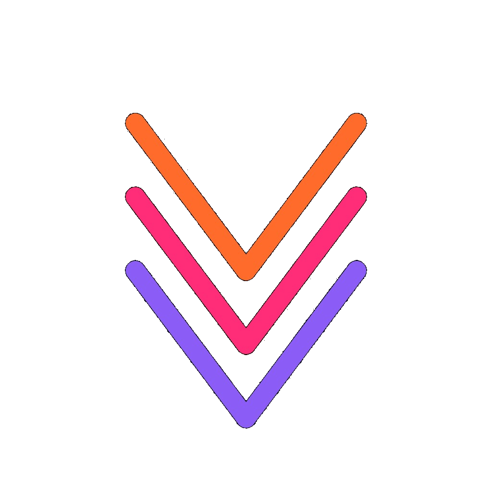

<p align="center">
  
  &nbsp;&nbsp;&nbsp;
  
</p>


<p align="center">
  <strong>Code with Intent.</strong><br />
  <sub>Native AOT compilation · First-class contracts · Structured concurrency · AI-era guardrails</sub>
</p>

<p align="center">
  <a href="https://github.com/skhan75/VibeLang/releases/tag/v1.0.0"></a>
  <a href="#performance"></a>
  <a href="#performance"></a>
  <a href="#performance"></a>
</p>

<p align="center">
  <a href="https://github.com/skhan75/VibeLang/stargazers"></a>
  <a href="https://github.com/skhan75/VibeLang/commits/main"></a>
  <a href="https://github.com/skhan75/VibeLang/issues"></a>
  <a href="LICENSE"></a>
</p>

<p align="center">
  <a href="https://www.thevibelang.org">Website</a> ·
  <a href="https://www.thevibelang.org/documentation">Documentation</a> ·
  <a href="#quickstart">Quickstart</a> ·
  <a href="#performance">Performance</a> ·
  <a href="CONTRIBUTING.md">Contributing</a>
</p>

---

VibeLang is a statically typed, natively compiled language where **intent is a first-class citizen**. You declare what a function should do, what it promises, how to test it, and what side effects it has — the compiler turns all of that into executable checks and native code.

As AI agents generate more production code, the gap between "compiles" and "correct" widens. VibeLang closes it with language-level guardrails that work whether code is written by humans, copilots, or autonomous agents.

```vibelang
pub transfer(from: Account, to: Account, amount: Int) -> Result<Receipt, BankError> {
  @intent "move funds between accounts preserving total balance"
  @require amount > 0
  @require from.balance >= amount
  @ensure to.balance == old(to.balance) + amount
  @ensure from.balance == old(from.balance) - amount
  @effect io

  from.balance = from.balance - amount
  to.balance   = to.balance + amount
  ok(Receipt { from: from.id, to: to.id, amount })
}
```

## Quickstart

**Download a binary** — no Cargo required:

```bash
# From GitHub Releases
tar xzf vibe-x86_64-unknown-linux-gnu.tar.gz
sudo mv vibe /usr/local/bin/
vibe --version
```

**Or build from source** (requires [Rust stable](https://rustup.rs/) + a C linker):

```bash
git clone https://github.com/skhan75/VibeLang.git && cd VibeLang
cargo build --release -p vibe_cli
export PATH="$PWD/target/release:$PATH"
```

**Create and run a project:**

```bash
vibe new myproject && cd myproject
vibe run main.yb          # compile + execute
vibe test main.yb         # run tests including @examples
vibe fmt . --check        # check formatting
vibe lint . --intent      # AI-powered drift detection (optional)
```

Platform guides: [Linux](docs/install/linux.md) · [macOS](docs/install/macos.md) · [Windows](docs/install/windows.md)

## Performance

VibeLang targets **systems-level performance** (native AOT binaries, predictable runtime behavior) while keeping AI-era guardrails first-class.

We track performance with the [PLB-CI](benchmarks/third_party/plbci/) suite (Docker-first, plus compile-loop timing). In the latest full run, VibeLang lands in the **C/C++/Rust neighborhood** on many workloads and shows **multi‑× speedups vs dynamic baselines** (geomean-overlap is ~4–15× vs Python/TypeScript, depending on the subset).

- **Publication policy**: `benchmarks/third_party/APPLE_TO_APPLE_BENCHMARK_POLICY.md`
- **CI runner**: `.github/workflows/third-party-benchmarks.yml` runs strict mode.
- **Reports**: [`reports/benchmarks/`](reports/benchmarks/third_party/full/summary.md)

## Contracts & Intent

| Annotation | Purpose |
|---|---|
| `@intent "..."` | Natural-language purpose; checked by AI sidecar for drift |
| `@require expr` | Precondition — verified at function entry |
| `@ensure expr` | Postcondition — `.` is the return value, `old()` snapshots pre-state |
| `@examples { f(x) => y }` | Executable test cases via `vibe test` |
| `@effect tag` | Side effects (`io`, `alloc`, `mut_state`, `concurrency`, `nondet`) — tracked transitively |

## Concurrency

```vibelang
results := chan(4)
go worker(3, results)
go worker(7, results)
first := results.recv()

select {
  case msg := inbox.recv() => handle(msg)
  case after 5 => timeout()
}
```

`go` spawns tasks, `chan` creates typed channels, `select` multiplexes with timeouts. The compiler tracks `@effect concurrency` transitively and checks sendability at compile time.

## Toolchain

One binary, nine commands:

| Command | What it does |
|---|---|
| `vibe check` | Type-check and validate contracts |
| `vibe build` | Compile to native binary |
| `vibe run` | Build and execute |
| `vibe test` | Run tests including `@examples` |
| `vibe fmt` | Format source code |
| `vibe doc` | Generate API documentation |
| `vibe lint` | Intent drift detection (optional AI sidecar) |
| `vibe pkg` | Dependency management |
| `vibe lsp` | Language server for editors |

VS Code extension: [`editor-support/vscode/`](editor-support/vscode/)

## Documentation

| Resource | Description |
|---|---|
| [The Book](https://www.thevibelang.org/documentation) | Learning path from basics to production patterns |
| [Language Spec](docs/spec/) | Grammar, type system, semantics, memory model |
| [CLI Manual](docs/cli/help_manual.md) | Commands, flags, and exit codes |
| [Stdlib Reference](docs/stdlib/reference_index.md) | Module index with stability tiers |
| [Examples](examples/) | 87 programs across 11 categories |

## Contributing

See **[CONTRIBUTING.md](CONTRIBUTING.md)** for the full guide.

```bash
git clone https://github.com/<you>/VibeLang.git && cd VibeLang
cargo build --release -p vibe_cli
cargo fmt --all && cargo clippy --workspace --all-targets -- -D warnings
cargo test -p vibe_cli
```

**Where to start:** issues labeled `good first issue` · [feature gaps](docs/checklists/features_and_optimizations.md) · [development checklist](docs/development_checklist.md)

## License

[Apache License 2.0](LICENSE) — Copyright 2025–2026 VibeLang Contributors
