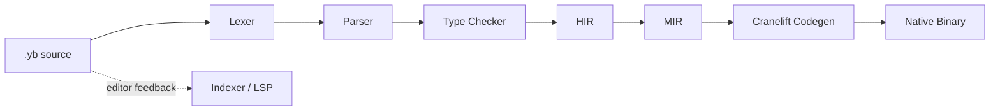

# VibeLang

<!-- markdownlint-disable MD033 -->
<p align="center">
  
</p>

<p align="center">
  <strong>The native-first language for intent-driven development.</strong><br />
  <sub>Deterministic AOT compilation. First-class contracts. Structured concurrency. Built for the AI era.</sub>
</p>

<p align="center">
  <a href="https://github.com/skhan75/VibeLang/releases/tag/v1.0.0"></a>
  <a href="#performance"></a>
  <a href="#installation"></a>
  <a href="#intent-driven-development"></a>
  <a href="LICENSE"></a>
</p>

<p align="center">
  <a href="#quickstart">Quickstart</a> &middot;
  <a href="#performance">Performance</a> &middot;
  <a href="#intent-driven-development">Intent Model</a> &middot;
  <a href="#code-examples">Code Examples</a> &middot;
  <a href="#contributing">Contributing</a> &middot;
  <a href="https://github.com/skhan75/VibeLang/tree/main/book">The Book</a>
</p>
<!-- markdownlint-enable MD033 -->

---

## What Is VibeLang

VibeLang is a statically typed, natively compiled programming language that embeds
**intent**, **contracts**, and **effect tracking** directly into the language. It
compiles to native binaries via Cranelift with zero runtime dependencies.

The core idea: you write code *and* intent together. The compiler verifies both.

| | |
|---|---|
| **Compilation** | Deterministic AOT via Cranelift — no VM, no JIT, no interpreter |
| **Type system** | Static with inference, generics (`List<T>`, `Map<K,V>`), effect tracking |
| **Contracts** | `@intent`, `@require`, `@ensure`, `@examples`, `@effect` — all first-class |
| **Concurrency** | `go`, `chan`, `select`, `after` with compile-time sendability checks |
| **Toolchain** | `vibe check`, `build`, `run`, `test`, `fmt`, `doc`, `lint --intent`, `pkg`, `lsp` |
| **AI integration** | Optional sidecar for intent drift detection — compiler never depends on AI |
| **License** | Apache 2.0 |

## Quickstart

### Option A — Packaged binary (no Cargo required)

Download the latest release for your platform:

| Platform | Package |
|---|---|
| Linux x86_64 | `vibe-x86_64-unknown-linux-gnu.tar.gz` |
| macOS x86_64 | `vibe-x86_64-apple-darwin.tar.gz` |
| Windows x86_64 | `vibe-x86_64-pc-windows-msvc.zip` |

```bash
# Linux example
tar xzf vibe-x86_64-unknown-linux-gnu.tar.gz
sudo mv vibe /usr/local/bin/
vibe --version
```

Detailed platform guides with checksum verification:
[Linux](docs/install/linux.md) ·
[macOS](docs/install/macos.md) ·
[Windows](docs/install/windows.md)

### Option B — Build from source

Requires [Rust](https://rustup.rs/) (stable) and a C linker (`build-essential` or `clang`).

```bash
git clone https://github.com/skhan75/VibeLang.git
cd VibeLang
cargo build --release -p vibe_cli
export PATH="$PWD/target/release:$PATH"
```

### Hello World

```bash
cat > hello.yb <<'EOF'
pub main() -> Int {
  @effect io
  println("hello from vibelang")
  0
}
EOF

vibe run hello.yb
```

```
hello from vibelang
```

### Full developer loop

```bash
vibe new myproject && cd myproject
vibe run main.yb          # build + execute
vibe test main.yb         # run tests + @examples
vibe fmt . --check        # format check
vibe doc . --out api.md   # generate docs
vibe lint . --intent      # AI drift detection (optional)
```

## Performance

Benchmarked with [Hyperfine](https://github.com/sharkdp/hyperfine) on the
[PLB-CI](https://github.com/nicholasgasior/plbci) suite — 18 programs covering
tree construction, matrix operations, concurrency, HTTP, JSON, and cryptography.

### Runtime (geometric mean speedup)

| Baseline | Speedup | Shared benchmarks |
|---|---|---|
| **Python** | **100x** faster | 16 |
| **TypeScript** | **71x** faster | 12 |
| **Elixir** | **333x** faster | 3 |
| **Go** | **27x** faster | 18 |
| **C** | **10.7x** faster | 5 |
| **C++** | **10.5x** faster | 5 |

### Memory footprint (average across all benchmarks)

| Language | Avg memory |
|---|---|
| **VibeLang** | **4.3 MB** |
| C | 3.5 MB |
| C++ | 2.0 MB |
| Go | 9.5 MB |
| Python | 27.0 MB |
| TypeScript | 74.5 MB |
| Elixir | 79.6 MB |

### Spotlight results

| Benchmark | VibeLang | Go | Python | What it tests |
|---|---|---|---|---|
| binarytrees | **1.53ms** | 199ms | 372ms | Tree construction, GC pressure |
| spectral-norm | **1.40ms** | 102ms | 2078ms | Dense matrix operations |
| http-server | **2.29ms** | 89ms | 1700ms | HTTP request handling |
| coro-prime-sieve | **1.64ms** | 12.3ms | 317ms | Concurrency throughput |
| json-serde | **17.3ms** | 113ms | 137ms | JSON parse + serialize |

> Environment: Linux WSL2, AMD Ryzen 9 5900X (24 cores), 32 GB RAM.
> Full results: [`reports/benchmarks/`](reports/benchmarks/)

## Intent-Driven Development

VibeLang introduces five annotation primitives that make intent executable:

```
pub clamp_percent(done: Int, total: Int) -> Int {
  @intent "return completion percentage clamped to [0, 100]"
  @examples {
    clamp_percent(0, 10)  => 0
    clamp_percent(5, 10)  => 50
    clamp_percent(10, 10) => 100
  }
  @require total > 0
  @ensure . >= 0
  @ensure . <= 100
  @effect alloc

  raw := (done * 100) / total
  if raw < 0 { 0 }
  else if raw > 100 { 100 }
  else { raw }
}
```

| Annotation | Purpose | Compile behavior |
|---|---|---|
| `@intent` | Natural-language description of function purpose | Checked by AI sidecar for drift detection |
| `@examples` | Input/output pairs | Lowered to executable test cases via `vibe test` |
| `@require` | Preconditions | Inserted as entry-check blocks; verified at function entry |
| `@ensure` | Postconditions (`.` = return value, `old()` = pre-state) | Inserted as exit-check blocks; verified before return |
| `@effect` | Side-effect declarations (`io`, `alloc`, `mut_state`, `concurrency`, `nondet`) | Tracked transitively through the entire call graph |

Run intent lint:

```bash
vibe lint . --intent --changed
```

## Code Examples

### Structured concurrency

```
worker(id: Int, done: Chan) -> Int {
  @effect concurrency
  done.send(id * id)
  0
}

pub main() -> Int {
  @effect concurrency
  @effect io
  @effect alloc
  done := chan(4)

  go worker(3, done)
  go worker(7, done)

  first := done.recv()
  second := done.recv()
  println(first + second)
  0
}
```

### Select with timeout

```
pub main() -> Int {
  @effect io
  @effect alloc
  @effect concurrency
  @effect nondet
  signal := chan(1)
  select {
    case value := signal.recv() => println("got data")
    case after 1 => println("timeout — retrying")
  }
  0
}
```

### Modules and imports

```
// math.yb
module demo.math

pub add(a: Int, b: Int) -> Int {
  a + b
}
```

```
// main.yb
module demo.main
import demo.math

pub main() -> Int {
  @effect io
  println(add(4, 5))
  0
}
```

### Agentic guardrail pipeline

```
evaluate_step(score: Int) -> Int {
  if score > 3 { return 0 }
  1
}

pub main() -> Int {
  @effect io
  @effect alloc
  steps := ["ingest", "plan", "act", "report"]
  risk := {"ingest": 1, "plan": 2, "act": 4, "report": 1}
  allowed := 1
  i := 0
  while i < steps.len() {
    step := steps.get(i)
    if evaluate_step(risk.get(step)) == 0 {
      allowed = 0
      i = steps.len()
    } else {
      i = i + 1
    }
  }
  if allowed == 0 {
    println("guardrail-blocked")
  } else {
    println("guardrail-allowed")
  }
  0
}
```

> 70 example programs across 10 categories: [`examples/`](examples/)

## Architecture

### Compilation pipeline



### Crate structure (17 crates)

| Crate | Role |
|---|---|
| `vibe_lexer` | Tokenization |
| `vibe_parser` | Recursive descent parsing with error recovery |
| `vibe_ast` | Abstract syntax tree definitions |
| `vibe_types` | Type checking, effect inference, AST → HIR lowering |
| `vibe_hir` | High-level IR with contract nodes and effect metadata |
| `vibe_mir` | Mid-level IR with concrete types and CFG |
| `vibe_codegen` | Cranelift-based native code generation |
| `vibe_runtime` | C runtime library (print, channels, GC, stdlib) |
| `vibe_diagnostics` | Deterministic error reporting with stable codes |
| `vibe_cli` | CLI orchestrator — `vibe check/build/run/test/fmt/doc/lint/pkg/lsp` |
| `vibe_fmt` | Source code formatter |
| `vibe_doc` | Documentation generator |
| `vibe_pkg` | Package manager (resolve, lock, install) |
| `vibe_indexer` | Code indexing for IDE support |
| `vibe_lsp` | Language Server Protocol implementation |
| `vibe_sidecar` | AI sidecar for intent linting |

### Toolchain commands

| Command | Description |
|---|---|
| `vibe check <file>` | Type-check and validate contracts |
| `vibe build <file>` | Compile to native binary |
| `vibe run <file>` | Build and execute |
| `vibe test <file>` | Run tests including `@examples` |
| `vibe fmt <dir>` | Format source code |
| `vibe doc <dir>` | Generate API documentation |
| `vibe lint --intent` | AI-powered intent drift detection |
| `vibe pkg resolve` | Resolve and lock dependencies |
| `vibe lsp` | Start language server |

## Language Reference

### Types

| Type | Description |
|---|---|
| `Int` | 64-bit integer |
| `Float` | 64-bit floating point |
| `Bool` | Boolean |
| `Str` | String |
| `List<T>` | Generic list |
| `Map<K, V>` | Generic map |
| `Chan` | Typed channel for concurrency |

### Syntax at a glance

```
x := 42                    // variable binding
x = x + 1                  // reassignment
if x > 0 { ... }           // conditionals
while x > 0 { x = x - 1 } // while loop
for item in list { ... }   // for-in loop
return value               // explicit return (optional — last expr is returned)
```

### Standard library

| Module | Stability | Surface |
|---|---|---|
| `io` | stable | `print`, `println` |
| `core` | stable | `len`, `min`, `max`, `sorted_desc`, `take` |
| `path` | stable | `join`, `parent`, `basename`, `is_absolute` |
| `time` | preview | `now_ms`, `sleep_ms`, `duration_ms` |
| `fs` | preview | `exists`, `read_text`, `write_text`, `create_dir` |
| `json` | preview | `is_valid`, `parse_i64`, `stringify_i64`, `minify` |
| `http` | preview | `status_text`, `default_port`, `build_request_line` |

Stability tiers and compatibility rules: [`stdlib/stability_policy.md`](stdlib/stability_policy.md)

## Editor Support

### VS Code

A VS Code extension with TextMate syntax highlighting and LSP integration is
available in [`editor-support/vscode/`](editor-support/vscode/).

Start the language server:

```bash
vibe lsp --transport jsonrpc
```

## Roadmap

| Area | Status |
|---|---|
| Core compiler (lex → parse → type → codegen → link) | Shipped |
| Contract system (@intent, @require, @ensure, @examples, @effect) | Shipped |
| Structured concurrency (go, chan, select) | Shipped |
| Standard library (io, fs, path, json, http, time) | Shipped (stable + preview) |
| Toolchain (check, build, run, test, fmt, doc, lint, pkg, lsp) | Shipped |
| AI sidecar for intent linting | Shipped |
| Packaged release pipeline (checksums, signatures, provenance, SBOM) | Shipped |
| Deeper AI suggestions and autocomplete | In progress |
| Full self-hosting compiler | In progress |
| Broader target matrix (ARM64, WASM) | Planned |

Full tracker: [`docs/development_checklist.md`](docs/development_checklist.md)

## Troubleshooting

| Problem | Fix |
|---|---|
| `cargo` not found | Install [rustup](https://rustup.rs/), then `cargo --version` |
| Linker errors on Linux | `sudo apt install build-essential` or `clang` |
| Mixed `.yb` / `.vibe` in same directory | Use `.yb` only — `.vibe` is legacy |
| Contract check failures in release builds | Contracts are dev/test only by default; see `docs/spec/contract_policy.md` |

## Contributing

We welcome contributions. See [CONTRIBUTING.md](CONTRIBUTING.md) for the full guide.

### Quick version

```bash
# Fork and clone
git clone https://github.com/<you>/VibeLang.git
cd VibeLang

# Build
cargo build --release -p vibe_cli

# Validate before submitting
cargo fmt --all
cargo clippy --workspace --all-targets -- -D warnings
cargo test -p vibe_cli

# Run the example suite
export PATH="$PWD/target/release:$PATH"
vibe run examples/01_basics/01_hello_world.yb
```

### What to work on

- Issues labeled [`good first issue`](https://github.com/skhan75/VibeLang/labels/good%20first%20issue)
- The [development checklist](docs/development_checklist.md) tracks all open work
- The [feature gaps checklist](examples/FEATURE_GAPS_CHECKLIST.md) lists language surface gaps

### Principles

1. **Determinism first** — same source + same flags = same binary
2. **Tests required** — every change must include or update tests
3. **No AI in the compile path** — the sidecar is optional; compilation is always offline-capable
4. **Keep it readable** — clear code over clever code

## License

Licensed under the [Apache License, Version 2.0](LICENSE).

```
Copyright 2025-2026 VibeLang Contributors

Licensed under the Apache License, Version 2.0 (the "License");
you may not use this file except in compliance with the License.
You may obtain a copy of the License at

    http://www.apache.org/licenses/LICENSE-2.0

Unless required by applicable law or agreed to in writing, software
distributed under the License is distributed on an "AS IS" BASIS,
WITHOUT WARRANTIES OR CONDITIONS OF ANY KIND, either express or implied.
See the License for the specific language governing permissions and
limitations under the License.
```
