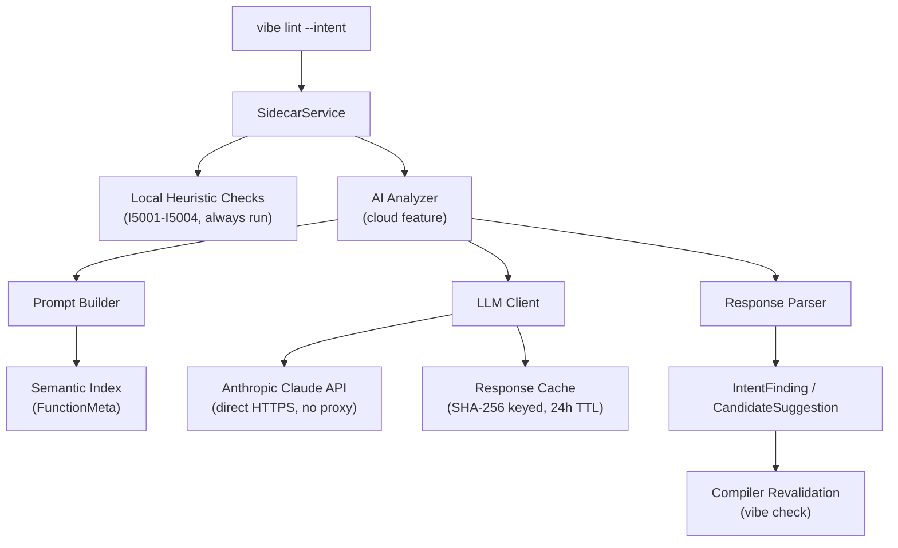

# VibeLang AI Sidecar Architecture (v1.0)

## Principle

AI is an optional assistant layer. It must never be required for:

- Parsing
- Type checking
- Contract validation
- Code generation correctness

Core compiler remains deterministic with AI fully disabled.

## BYOK (Bring Your Own Key)

VibeLang does **not** operate a centralized API proxy or relay. There is no
VibeLang-hosted inference service. The developer provides their own Anthropic
API key and all LLM traffic goes directly from their machine to the Anthropic
API. VibeLang never sees, stores, or proxies API keys or inference traffic.

**Key resolution (precedence order):**

1. `ANTHROPIC_API_KEY` environment variable — most common, works in CI
2. `~/.config/vibe/sidecar.toml` — global per-machine config (set once)
3. `vibe.toml` `[sidecar]` section — per-project override

**No key = no error.** Without an API key, `vibe lint --intent` runs all local
heuristic checks (I5001–I5004). AI features are silently skipped.

## Responsibilities

AI sidecar provides:

- Intent-drift linting on demand (`vibe lint --intent`) — W0801
- Intent suggestion (`@intent` drafts) — I5007
- Contract suggestion (`@require/@ensure` candidates) — I5005
- Example generation proposals (`@examples`) — I5006
- Refactor hints from semantic index

AI sidecar does **not** directly mutate compiler state or bypass checks.

## High-Level Architecture

## Integration Surface

- Input:
  - semantic index snapshots (FunctionMeta)
  - source code (redacted string literals by default)
  - contract and effect metadata
- Output:
  - drift warnings (W0801) with confidence and rationale
  - suggested contracts, examples, and intents
  - all suggestions include provenance and confidence

Accepted suggestions are always revalidated by the compiler.

## Trust and Safety Model

- Sidecar output is advisory only.
- No auto-apply without user confirmation.
- Suggestions include provenance and confidence.
- String literals and comments are redacted before sending (`redact_strings = true`).
- All AI-generated suggestions pass through `revalidate_and_gate_suggestions` (compiler check).

## Deployment Modes

| Mode | Behavior |
|---|---|
| `local` | Heuristic checks only (I5001–I5004). No network calls. Default. |
| `hybrid` | Local checks first, then AI analysis if API key is available. |
| `cloud` | AI analysis for all functions with `@intent`. Requires API key. |

## LLM Provider

- **Provider:** Anthropic Claude
- **Default model:** `claude-sonnet-4-20250514`
- **Configurable:** model, endpoint, budget caps
- **Custom endpoints:** AWS Bedrock, corporate proxies via `endpoint` config

## Caching

- Key: SHA-256 of (signature hash + intent text + model + prompt version)
- TTL: 24 hours (configurable via `cache_ttl_hours`)
- Storage: `.yb/cache/sidecar/` as JSON files
- Cache invalidation: automatic on prompt version bump or model change

## Failure Modes

If sidecar fails:

- IDE continues with normal compiler/index diagnostics.
- No build/test step is blocked.
- Network failure → return local-only findings + I9003
- Timeout → return partial findings + I9002
- Budget exhausted → return local-only findings + I9001
- Malformed LLM response → skip that function, log warning

## Non-Blocking Guarantee

- Sidecar diagnostics are advisory and out-of-band from compile correctness.
- Parse/type/codegen/link phases never wait on sidecar completion.
- Timeouts or budget exhaustion degrade to deterministic non-AI diagnostics.
- `vibe build`, `vibe run`, `vibe test` never invoke the sidecar.

## Finding Codes

| Code | Severity | Description |
|---|---|---|
| I5001 | Warning | Public function missing `@intent` |
| I5002 | Warning | Intent text is too vague |
| I5003 | Info | Effect mismatch (declared vs observed) |
| I5004 | Info | Public function missing `@examples` |
| I5005 | Info | AI-suggested `@require`/`@ensure` contract |
| I5006 | Info | AI-suggested `@examples` |
| I5007 | Info | AI-drafted `@intent` for missing annotation |
| W0801 | Warning | Intent drift detected (semantic mismatch) |
| I9001 | Warning | Budget exhausted |
| I9002 | Warning | Latency budget exceeded |
| I9003 | Warning | AI analysis unavailable (network failure) |

## API Boundaries

- Read-only access to semantic index
- No direct write access to source files
- Interaction through editor tooling APIs that require user approval
