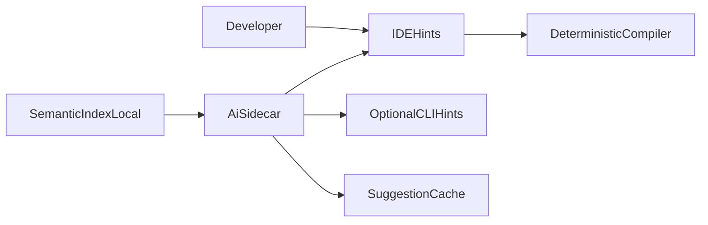

# VibeLang AI Sidecar Architecture (v0.1)

## Principle

AI is an optional assistant layer. It must never be required for:

- Parsing
- Type checking
- Contract validation
- Code generation correctness

Core compiler remains deterministic with AI fully disabled.

## Responsibilities

AI sidecar provides:

- Intent suggestion (`@intent` drafts)
- Contract suggestion (`@require/@ensure` candidates)
- Example generation proposals (`@examples`)
- Intent-drift linting on demand (`vibe lint --intent`)
- Refactor hints from semantic index
- Performance hinting from static and profiling data

AI sidecar does **not** directly mutate compiler state or bypass checks.

## High-Level Architecture

## Integration Surface

- Input:
  - semantic index snapshots
  - diagnostics history
  - optional profiling traces
- Output:
  - suggested edits (human-accepted)
  - rationale text
  - confidence score

Accepted suggestions are always revalidated by compiler.

## Trust and Safety Model

- Sidecar output is advisory only.
- No auto-apply without user confirmation.
- Suggestions include provenance and confidence.
- Sensitive content redaction policy before remote inference.

## Deployment Modes

- Local model mode (preferred default)
- Hybrid mode (local first, remote fallback)
- Cloud mode (explicit opt-in)

## Failure Modes

If sidecar fails:

- IDE continues with normal compiler/index diagnostics.
- No build/test step is blocked.
- Sidecar can restart independently.

## Non-Blocking Guarantee

- Sidecar diagnostics are advisory and out-of-band from compile correctness.
- Parse/type/codegen/link phases never wait on sidecar completion.
- Timeouts or budget exhaustion degrade to deterministic non-AI diagnostics.

## Intent Linting Workflow

On-demand intent lint should:

1. Read semantic index + contract/effect metadata.
2. Produce drift and quality diagnostics with confidence levels.
3. Include rationale and evidence references.
4. Return warnings by default (optional CI gating by policy).

## API Boundaries

- Read-only access to semantic index
- No direct write access to source files
- Interaction through editor tooling APIs that require user approval
