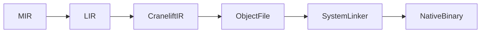

# VibeLang Codegen Strategy (v0.1)

## Decision

V0.1 uses a two-tier backend strategy:

1. **Primary backend**: Cranelift for fast compile and simpler integration
2. **Future backend**: LLVM for maximum peak optimization in later phases

This supports fast development now while preserving long-term optimization path.

## Target Platforms (Initial)

- Linux x86_64
- Linux arm64
- macOS arm64

## Codegen Pipeline

## Responsibilities

## Lowering Layer

- Convert MIR ops to backend-friendly forms.
- Materialize calling conventions and ABI details.
- Emit safepoints and stack maps metadata.

## Backend Layer

- Instruction selection
- Register allocation
- Machine code emission

## Link Layer

- Link object files with runtime support libraries
- Produce executable/shared library as requested

## ABI and Calling Convention

V0.1 uses platform C ABI for external boundaries.

Benefits:

- Straightforward FFI with C ecosystem
- Predictable interop behavior

Internal calling convention may diverge later for performance once stable.

## Runtime Hooks

Codegen inserts calls/intrinsics for:

- Allocation fast/slow paths
- GC safepoints
- Panic and contract-failure handling
- Scheduler/channel runtime ops

## Build Modes

## Dev Mode

- Faster codegen settings
- Moderate optimization
- Rich debug info

## Release Mode

- Aggressive optimization
- Reduced debug metadata
- Configurable contract check retention policy

## Debug Info

Emit DWARF-compatible debug info in v0.1:

- Function and local variable mapping
- Source line tables
- Inlined call-site mapping where available

## Object Layout and Sections

- `.text` executable code
- `.rodata` constants and metadata
- `.data/.bss` mutable globals
- custom metadata sections for stack maps and contracts (debug profile)

## Validation

Codegen validation layers:

- MIR verifier before lowering
- Backend IR verifier (where available)
- Post-link smoke validation (`vibe run --check-binary`)

## Future Extensions

- Link-time optimization
- Profile-guided optimization
- Optional LLVM backend selection (`--backend=llvm`)
