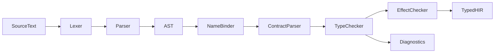

# VibeLang Frontend Architecture (v0.1)

## Scope

The frontend is responsible for converting source files into a fully typed High-Level IR (HIR) plus diagnostics.

## Frontend Pipeline



## Phase Responsibilities

## 1. Lexer

- Tokenizes input into identifiers, literals, operators, punctuation, and annotation tokens.
- Preserves trivia (comments/whitespace) in side-channel for tooling and formatter.
- Emits recoverable lexical diagnostics with source span.

Key token classes:

- `Ident`, `IntLit`, `FloatLit`, `StringLit`
- Structural: `{`, `}`, `(`, `)`, `[`, `]`, `,`, `.`
- Operators: `=`, `:=`, `=>`, `->`, `?`
- Annotation prefix: `@`

## 2. Parser

- Builds concrete and abstract syntax trees.
- Supports error recovery via synchronization points (`}`, newline, declaration start).
- Parses contract annotations into dedicated AST nodes, not generic comments.

## 3. Name Binder

- Builds module symbol tables.
- Resolves local/global references.
- Detects shadowing and undefined symbol usage.

## 4. Contract Parser

- Validates placement and shape of `@intent/@examples/@require/@ensure/@effect`.
- Converts annotations into contract AST attached to function node.

## 5. Type Checker

- Resolves expression and declaration types.
- Applies inference for local bindings.
- Enforces function signatures on public APIs.
- Type-checks contract expressions in same context as function body.

## 6. Effect Checker

- Computes observed effect summary for each function.
- Compares summary against declared `@effect`.
- Feeds diagnostics and metadata into HIR.

## AST and HIR Shape

## AST (Syntax-Centric)

- Preserves source-level forms close to original code.
- Includes contract nodes as direct children of function declaration.

## HIR (Semantic-Centric)

- Desugared control-flow constructs.
- Typed expressions and explicit call targets.
- Synthetic nodes for precondition/postcondition checks.

## Diagnostics Strategy

Diagnostics must be:

- Precise (single-source span and related spans)
- Actionable (what failed and how to fix)
- Stable (deterministic ordering)

Severity levels:

- `error`: compilation stops for module
- `warning`: compilation continues
- `info`: optional advisory

Diagnostic record:

```txt
{
  code: "E1023",
  message: "unknown symbol `srot_desc`; did you mean `sort_desc`?",
  span: [line_start, col_start, line_end, col_end],
  related: [...]
}
```

## Error Recovery Rules

- Recover after parse error at declaration boundaries.
- Continue type checking unaffected declarations.
- Emit grouped diagnostics in source order.

This allows "many errors in one run" behavior for productive iteration.

## Incrementality Hooks

Frontend nodes carry stable IDs for caching:

- `FileHash`
- `DeclHash`
- `TypeSigHash`
- `ContractHash`

These keys drive invalidation for partial recompilation.

## CLI Frontend Interface (Planned)

- `vibe check <path>`: parse + type + contracts diagnostics
- `vibe ast <path>`: print AST for debugging
- `vibe hir <path>`: print typed HIR

## Milestones

1. Parse and type-check core expression language
2. Add contract parsing + type checking
3. Add effect inference and mismatch diagnostics
4. Stabilize diagnostic codes and messages
