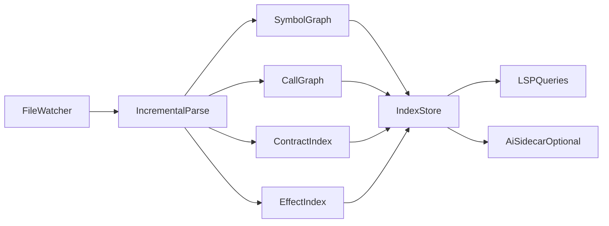

# VibeLang Semantic Indexer (Local-First)

## Purpose

The semantic indexer is an always-on local service that powers:

- Symbol navigation (go-to definition/references)
- Intent and contract search
- Lightweight drift detection
- Diagnostics acceleration for IDE/LSP

It is part of the default toolchain and works fully offline.

## Architecture



## Indexed Artifacts

- Declarations: modules, types, functions
- References: uses of declarations
- Contracts: `@intent`, `@require`, `@ensure`, `@effect`, examples count
- Effects summary per function
- Public API signature fingerprints

## Data Model (v0.1)

Minimal records:

```txt
Symbol {
  id, name, kind, module, file, span
}

FunctionMeta {
  symbol_id,
  signature_hash,
  effects: [effect],
  intent_text: string?,
  has_examples: bool
}
```

## Update Model

- File-level change detection by content hash.
- Re-index only affected files and reverse dependencies.
- Persist index on disk for quick IDE startup.

## Query APIs

- `findSymbol(name)`
- `findReferences(symbolId)`
- `findByIntent(textQuery)`
- `listMissingExamples(publicOnly=true)`
- `effectMismatches()`

## Cost and Performance Targets

- Initial cold index for 100K LOC: under 5 seconds on developer laptop
- Incremental update for single-file edit: under 100 ms median
- Index store memory overhead: under 10% of source footprint

## Integration Boundaries

- **Compiler**: consumes stable signatures/effects metadata
- **LSP**: consumes symbol and diagnostics indices
- **AI Sidecar**: read-only access to index; no direct mutation

## Reliability Constraints

- Index corruption cannot block compilation.
- On index load failure, rebuild from source automatically.
- Versioned index schema with migration strategy.
