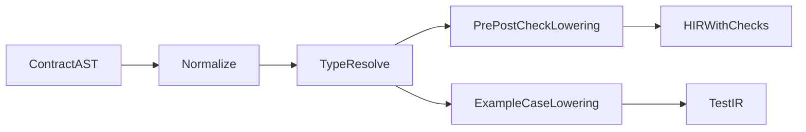

# Contract and Intent Engine (v0.1)

## Objective

Lower annotation contracts into deterministic checks and generated tests.

Supported annotations:

- `@intent`
- `@examples`
- `@require`
- `@ensure`
- `@effect`

## Pipeline



## Internal Representation

```txt
ContractSet {
  intent_text: Option<String>,
  requires: Vec<ExprId>,
  ensures: Vec<ExprId>,
  examples: Vec<ExampleCase>,
  effects: Vec<EffectTag>,
}
```

## Lowering Semantics

- `@require`: inserts pre-check nodes at function entry.
- `@ensure`: inserts post-check nodes before return edges.
- `@examples`: emits generated test functions in synthetic module.
- `@effect`: checked against observed and transitive effect summary.

## Runtime and Build Behavior

- Dev/test builds: contract checks enabled by default.
- Release builds: configurable policy (`strict`, `balanced`, `off` for non-critical checks).

## Determinism Safeguards

- Contract expressions cannot call nondeterministic APIs.
- Example evaluations run in deterministic harness mode.
- Network and wall-clock calls are blocked in generated checks.

## Diagnostics from Contract Engine

Examples:

- `E2201`: unknown effect tag
- `E2202`: invalid `old(...)` context
- `E2203`: nondeterministic call in contract expression
- `E2204`: malformed example case
