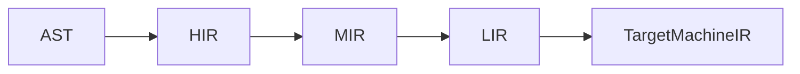

# VibeLang IR Overview (v0.1)

## Why Multiple IRs

A single IR is rarely ideal for all compiler phases. VibeLang uses staged IRs to balance:

- Fast frontend and incremental checks
- Strong optimization opportunities
- Backend portability

## IR Stack

## HIR (High-Level IR)

Purpose:

- Typed, source-adjacent representation
- Carries contract semantics and effect metadata

Properties:

- Explicit symbol links
- Structured control flow (if/loop/select intact)
- Synthetic contract nodes inserted (`require_check`, `ensure_check`)

Use cases:

- Type-driven diagnostics
- Effect inference
- Early optimization passes (constant folding, dead branch elimination)

## MIR (Mid-Level IR, SSA-like)

Purpose:

- Canonical optimization form for core transformations

Properties:

- CFG + SSA values
- Explicit basic blocks and branch edges
- Lowered control flow from structured forms
- Memory operations explicit

Primary passes:

- Inlining (heuristic)
- Common subexpression elimination
- Dead code elimination
- Escape analysis hooks

## LIR (Low-Level IR)

Purpose:

- Bridge from MIR to backend-specific machine IR

Properties:

- Lower-level operations with concrete calling convention decisions
- Stack slot abstraction
- GC safepoint and stack map annotations attached

Primary passes:

- Instruction selection preparation
- Register allocation preparation
- Calling convention lowering

## Target Machine IR

Produced by backend (Cranelift in v0.1 baseline).

Responsibilities:

- Final instruction selection
- Register allocation
- Emission to object code

## Contract and Check Lowering

Contract nodes are represented in HIR and lowered as follows:

- `@require` -> entry check blocks in MIR
- `@ensure` -> exit check blocks in MIR
- `@examples` -> synthetic test module (parallel IR path)

## GC and Runtime Metadata Propagation

Metadata attached through IR chain:

- Safepoint positions
- Stack maps
- Type maps for precise tracing
- Effect summary markers for diagnostics and tooling

## Incremental Compilation Keys

Each stage caches per-function artifacts using:

- Signature hash
- Body hash
- Contract hash
- Dependencies hash

## Optimization Philosophy (v0.1)

- Prioritize compile speed and predictable performance.
- Include only high-leverage, low-complexity optimizations initially.
- Defer expensive whole-program transforms to later milestones.
