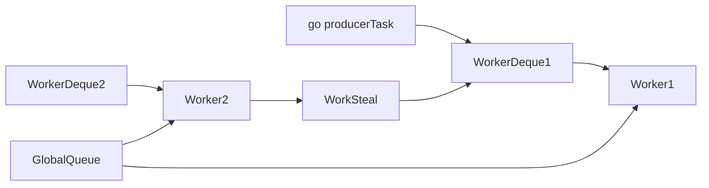

# VibeLang Concurrency Runtime Design (v0.1)

## Goals

- Make multicore concurrency easy to express (`go`, `chan`, `select`)
- Provide safe defaults against common race and deadlock foot-guns
- Scale from small apps to high-throughput backend services

## Core Abstractions

## Task

- Lightweight scheduled unit created by `go`.
- Lower overhead than OS threads.
- Can block on channels, timers, and I/O without blocking scheduler worker.

## Worker

- Runtime-managed OS thread that executes runnable tasks.
- Worker count defaults to CPU core count with adaptive tuning.

## Channel

- Typed message queue (`chan<T>`) with bounded capacity in v0.1.
- Supports blocking and non-blocking operations.
- Provides synchronization and visibility boundary for messages.

## Scheduler Architecture

Scheduler model: M:N work-stealing.

- M tasks multiplexed across N workers.
- Each worker has local deque.
- Global queue for external enqueue and balancing.
- Work stealing for load balance.

## Structured Concurrency

V0.1 structured primitives:

- `task_scope { ... }` conceptual scope (runtime + compiler lowering target)
- Child tasks are tied to parent scope lifetime
- Scope exit waits for children or cancels based on policy

Default policy:

- On child failure, propagate cancellation to sibling tasks in same scope.

## Channel Semantics

## Creation

- `chan<T>(capacity)` creates bounded channel.
- Capacity must be non-negative integer literal or constant expression.

## Send

- `ch.send(v)` blocks when full.
- Non-blocking variant planned with `try_send`.

## Receive

- `ch.recv()` blocks when empty.
- On closed and drained channel, receives closed signal state.

## Close

- `ch.close()` indicates no further sends.
- Sending to closed channel is runtime error in debug, defined failure in release.

## Select Semantics

`select` waits on multiple channel/timer events:

- Fair pseudo-randomized case selection among ready branches
- Optional `default` branch for non-blocking behavior
- Supports timer cases (`after duration`)

## Cancellation Model

- Cancellation tokens flow through task scopes.
- Blocking operations observe cancellation and return promptly.
- Cancellation is cooperative and explicit in runtime APIs.

## Data Race Safety Strategy

- Encourage ownership transfer through channels.
- Shared mutable state requires explicit synchronization primitives.
- Runtime and compiler checks flag unsafe patterns where analyzable.

## Runtime APIs (Conceptual)

- `spawn(fn) -> TaskHandle`
- `chan<T>(n) -> Channel<T>`
- `select(cases...)`
- `task_scope(policy, fn)`
- `cancel(token)`

## Interactions with GC

- Task stacks are roots during GC safepoints.
- Channel queues store references that must be traced.
- Scheduler queues and timers participate in root enumeration.

## Failure and Panic Semantics

- Panic in detached task is reported to runtime panic handler.
- Panic in structured scope propagates to parent as scope failure.
- Configurable panic policy for service environments.

## Observability

Expose runtime metrics:

- Runnable tasks count
- Queue depths (local/global)
- Steal attempts and success rate
- Channel contention and blocking duration
- Task latency distribution

## Performance Targets (v0.1)

- Spawn overhead low enough for thousands of concurrent tasks per core
- Channel throughput competitive with modern runtime baselines
- Near-linear speedup on CPU-bound partitionable workloads up to core count
