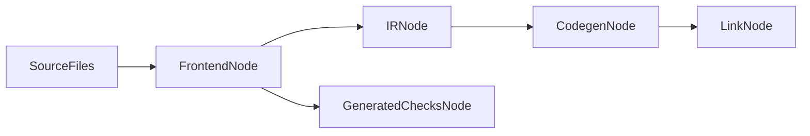

# VibeLang Build System Design (v0.1)

## Goals

- Fast local feedback loop
- Deterministic outputs
- Incremental and parallel by default
- Simple user-facing interface

## CLI Surface

- `vibe build`
- `vibe check`
- `vibe test`
- `vibe run`

Common flags:

- `--profile dev|release`
- `--target <triple>`
- `--backend cranelift|llvm` (llvm future)
- `--offline`

## Build Graph Model

Each package/module compiles as a node in directed acyclic build graph.

Node types:

- Parse/type-check node
- HIR/MIR generation node
- Codegen node
- Link node
- Generated-checks node



## Determinism

Deterministic build requires:

- Pinned toolchain version
- Stable diagnostic ordering
- Stable symbol and object naming
- Normalized timestamps in build artifacts where possible

## Parallelism Strategy

- Parallelize independent build graph nodes.
- Frontend and generated-check preparation can run in parallel with unaffected codegen nodes.
- Cap parallelism to available cores with configurable limit.

## Build Profiles

## Dev

- Fast compile settings
- Extended diagnostics
- Contracts enabled

## Release

- Optimized codegen
- Configurable contract retention
- Optional stripped symbols

## Artifact Layout

Suggested output layout:

```txt
.vibe/
  cache/
  index/
  artifacts/
    dev/
    release/
```

## Diagnostics and UX

- Unified multi-stage diagnostics in one report.
- Colored human output + JSON mode for tools.
- Keep first error actionable while still surfacing additional independent errors.

## CI and Reproducibility

- `vibe build --offline --locked` mode for CI reproducibility.
- Build metadata includes:
  - toolchain hash
  - dependency lock hash
  - source graph hash

## Performance Targets (v0.1)

- Medium project clean build: under 20 seconds on reference laptop
- No-op rebuild: under 500 ms
- Single-file changed rebuild: under 2 seconds median
